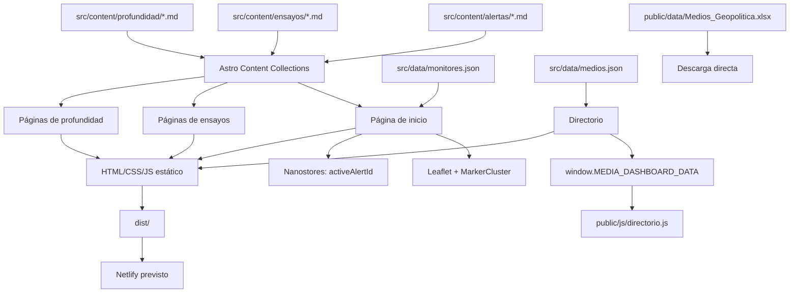
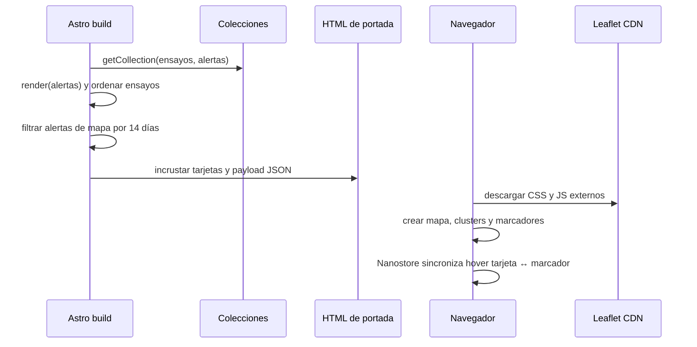
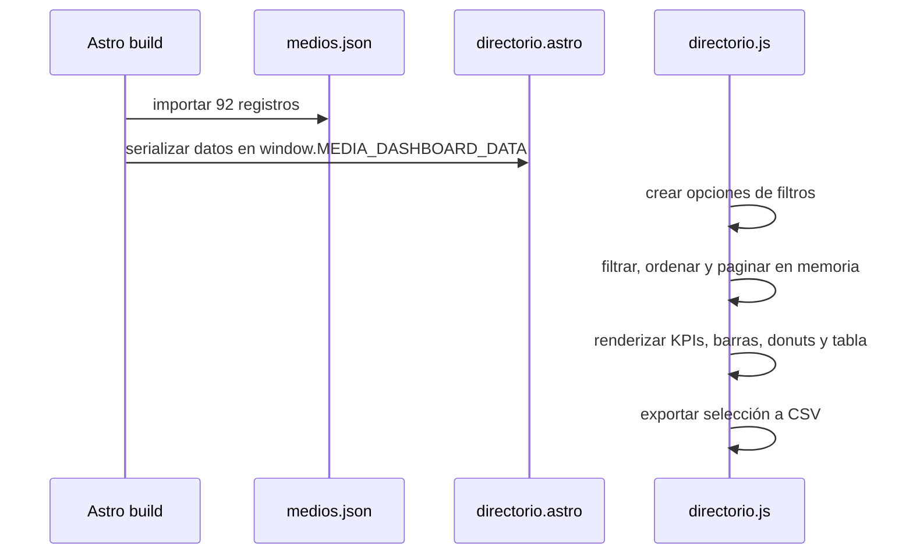

# 02. Arquitectura actual

## 2.1 Vista general

El sitio sigue una arquitectura Astro estática con contenido Markdown y datos JSON incorporados durante el build. Una parte de la interactividad se hidrata mediante scripts del navegador sin framework de componentes cliente.

## 2.2 Capas

### Capa de presentación

- `src/layouts/Layout.astro`: documento HTML, metadatos y estilos globales.
- `src/components/*.astro`: componentes de portada y encabezado.
- `src/pages/*.astro`: composición y routing.
- `src/pages/directorio.astro`: aplicación autocontenida con markup y CSS extenso.

### Capa de contenido

- Colecciones `alertas`, `ensayos` y `profundidad` declaradas en `src/content.config.ts`.
- Archivos Markdown como fuente editorial.
- IDs de ruta derivados del nombre del archivo.

### Capa de datos

- JSON importado en build para paneles y directorio.
- Excel expuesto como archivo descargable.
- No existe una capa de acceso a datos ni un script de sincronización.

### Capa de estado cliente

- `activeAlertId` en Nanostores sincroniza tarjetas y marcadores de la portada.
- El directorio usa un objeto local `state` en JavaScript vanilla.
- El tema del directorio se persiste con `localStorage`.
- Los filtros del directorio se reflejan parcialmente en la query string.

## 2.3 Flujos principales

### Portada

### Directorio

## 2.4 Características arquitectónicas relevantes

- **Generación estática:** no hay servidor de aplicación en tiempo de ejecución.
- **Contenido validado:** Zod valida frontmatter de las tres colecciones.
- **JavaScript selectivo:** la mayor parte del contenido se renderiza en servidor; mapa y directorio se ejecutan en cliente.
- **Dependencias externas de portada:** Leaflet, MarkerCluster y Phosphor Icons se cargan desde CDN.
- **Acoplamiento editorial:** una alerta referencia su página profunda mediante un string sin validación referencial.
- **Doble sistema visual:** la UI general usa Tailwind; el directorio mantiene un sistema CSS propio.

## 2.5 Puntos de acoplamiento

| Origen | Destino | Contrato actual | Riesgo |
|---|---|---|---|
| Alerta Markdown | Página de profundidad | `vinculo` coincide con ID de archivo | No se valida que la ruta exista. |
| Alerta Markdown | Mapa | `coordenadas`, `severity`, `date`, `en_mapa` | TTL calculado en build. |
| Mapa | Tarjeta | ID de alerta compartido en Nanostore | Interacción principalmente por mouse. |
| Excel | JSON del directorio | Sin script incluido | Posible divergencia de datos. |
| JSON de medios | JavaScript del directorio | `metadata`, `columns`, `records` | Contrato no tipado en código. |
| Header | Rutas | URLs hardcodeadas | Dos rutas no existen. |
