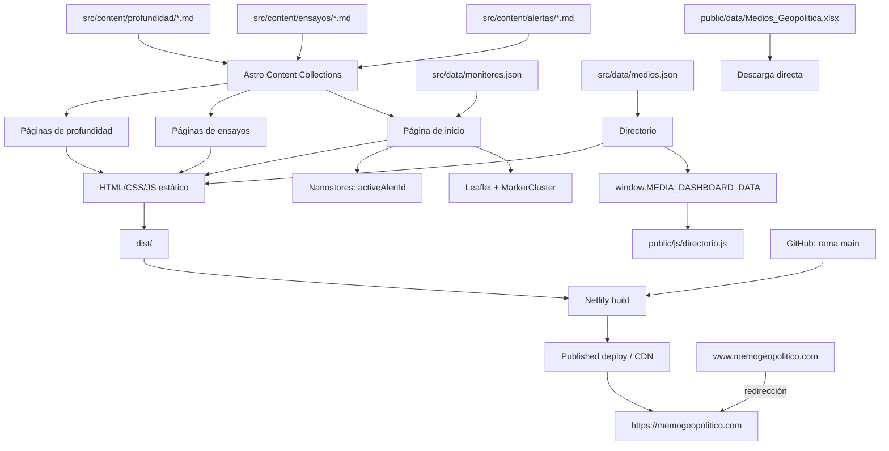
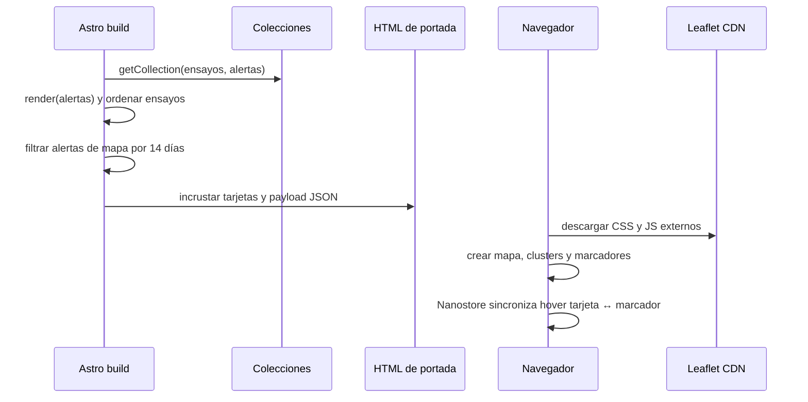
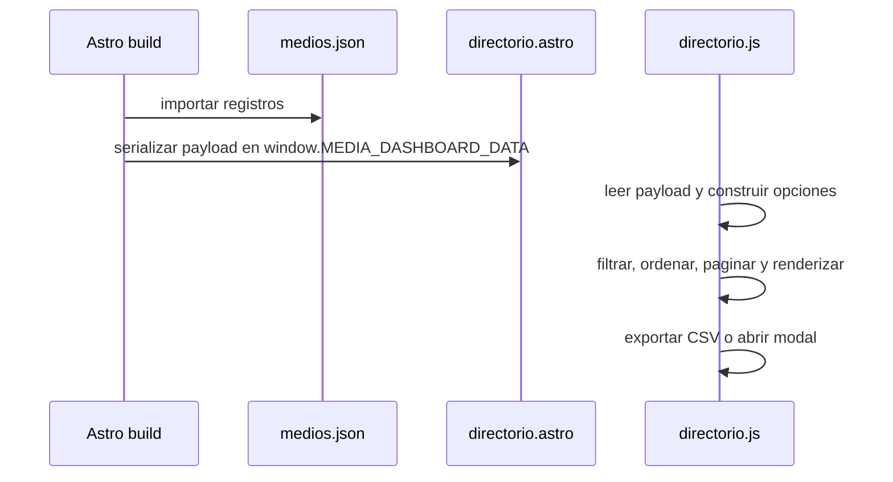
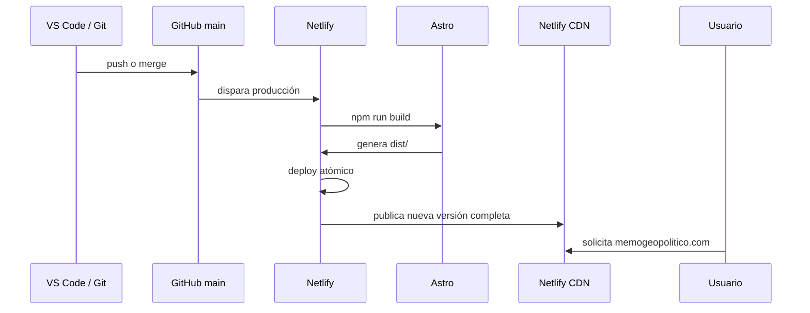

# 02. Arquitectura actual

## 2.1 Vista general

El sitio sigue una arquitectura Astro estática con contenido Markdown y datos JSON incorporados durante el build. Una parte de la interactividad se ejecuta mediante scripts del navegador sin framework de componentes cliente. El artefacto `dist/` se despliega desde GitHub hacia Netlify y se publica en `memogeopolitico.com`.

## 2.2 Capas

### Capa de presentación

- `src/layouts/Layout.astro`: documento HTML, metadatos y estilos globales.
- `src/components/*.astro`: componentes de portada y encabezado.
- `src/pages/*.astro`: composición y routing.
- `src/pages/directorio.astro`: aplicación autocontenida con markup y CSS extenso.

### Capa de contenido

- Colecciones `alertas`, `ensayos` y `profundidad` declaradas en `src/content.config.ts`.
- Archivos Markdown como fuente editorial.
- IDs de ruta derivados del nombre del archivo.

### Capa de datos

- JSON importado en build para paneles y directorio.
- Excel expuesto como archivo descargable.
- No existe una capa de acceso a datos ni un script de sincronización.

### Capa de estado cliente

- `activeAlertId` en Nanostores sincroniza tarjetas y marcadores de la portada.
- El directorio usa un objeto local `state` en JavaScript vanilla.
- El tema del directorio se persiste con `localStorage`.
- Los filtros del directorio se reflejan parcialmente en la query string.

### Capa de despliegue

- GitHub aporta la rama de producción `main`.
- Netlify ejecuta `npm run build` desde la raíz.
- Netlify publica exclusivamente `dist`.
- El published deploy documentado corresponde al commit `9b2b70d`.
- Netlify sirve el sitio desde su CDN y gestiona el certificado Let’s Encrypt.

## 2.3 Flujos principales

### Portada

### Directorio

### Deploy de producción

## 2.4 Fronteras y acoplamientos

- Alertas y artículos se enlazan mediante strings manuales, sin integridad referencial.
- Los colores de severidad se repiten en CSS, componentes y lógica cartográfica.
- Leaflet y Phosphor dependen de recursos globales/CDN.
- `directorio.astro` entrega datos a un script global mediante `window`.
- Excel y JSON representan el mismo dominio sin proceso reproducible dentro del repositorio.
- La configuración efectiva de Netlify vive en la interfaz; no existe `netlify.toml` en la instantánea entregada.

## 2.5 Diferencia entre instantánea y producción

La copia de código analizada fue enviada antes del deploy documentado. La evidencia de Netlify indica un commit posterior llamado “Configura Node 24 para Netlify”. Por ello:

- la arquitectura funcional se describe desde la instantánea entregada;
- los datos de build, dominio y TLS se describen desde Netlify;
- cualquier archivo añadido después —por ejemplo `.nvmrc`— debe confirmarse en una futura copia del repositorio antes de considerarlo parte del inventario fuente.

## 2.6 Características no presentes

- backend;
- API propia;
- base de datos;
- autenticación;
- renderizado SSR;
- funciones de Netlify activas;
- CMS;
- tests automatizados;
- observabilidad o analytics documentados.
