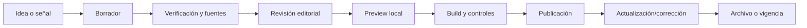

# 05. Modelo editorial

## 5.1 Tipos de contenido actuales

### Alertas y focos

Piezas breves situadas en la columna izquierda de la portada. Incluyen región, fecha, severidad, coordenadas y un enlace a un análisis más extenso.

**Rol editorial inferido:** detectar hechos o movimientos que merecen seguimiento inmediato.

### Alerta en profundidad

Artículo vinculado a una alerta mediante el campo `vinculo`.

**Rol editorial inferido:** aportar contexto, actores, escenarios y conclusión sobre un evento alertado.

### Ensayos / Análisis a fondo

Piezas extensas con descripción, autor y etiquetas. La portada muestra hasta cinco, ordenadas por fecha descendente.

**Rol editorial inferido:** análisis temático de largo aliento no necesariamente atado a una alerta reciente.

### Directorio

Base comparativa de 92 fuentes con criterios editoriales, institucionales y metodológicos.

**Rol editorial:** herramienta de selección y triangulación de fuentes.

### Fricción vs. narrativa

Prototipo que compara escalada física y foco mediático en tres teatros.

**Rol potencial:** detectar asimetrías entre acontecimientos y cobertura. Todavía faltan metodología, actualización, fuentes, fecha y responsable editorial.

## 5.2 Taxonomías actuales

- `region` en alertas: texto libre en mayúsculas.
- `tags` en ensayos: array libre.
- `severity`: vocabulario cerrado `critical | high | medium | low`.
- Directorio: región, familia, función epistemológica, perspectiva, confianza y estado, definidos por los datos.

## 5.3 Problemas de consistencia editorial

- “Análisis a fondo” identifica visualmente la lista de ensayos, mientras la navegación también lo presenta como sección independiente no implementada.
- “Para profundizar” se usa como llamada a la acción de alertas, pero el header apunta a `/profundizar` y las páginas reales están bajo `/profundidad/`.
- No hay descripción formal de cuándo una pieza debe ser alerta, profundidad o ensayo.
- La severidad está presente en alertas y profundidad, pero no se documenta su metodología.
- No existe estado editorial (`draft`, `review`, `published`, `archived`).
- No hay autor en páginas de profundidad ni responsable de actualización.

## 5.4 Modelo editorial recomendado

| Tipo | Horizonte | Extensión | Campos adicionales recomendados |
|---|---|---|---|
| Alerta | horas/días | breve | `summary`, `updatedAt`, `status`, `sources`, `expiresAt` |
| Profundidad | días/semanas | media | `description`, `author`, `updatedAt`, `relatedAlert`, `sources`, `methodologyNote` |
| Ensayo | largo plazo | extensa | `slug`, `excerpt`, `author`, `coverImage`, `canonical`, `draft`, `featured` |
| Monitor | actualización periódica | panel | `asOf`, `methodology`, `sources`, `owner`, `confidence` |

## 5.5 Ciclo editorial sugerido

## 5.6 Regla de trazabilidad

Toda afirmación temporal o cuantitativa debería permitir identificar:

- fecha de observación;
- fuente primaria o secundaria;
- grado de confianza;
- responsable de revisión;
- fecha de última actualización;
- correcciones posteriores.
