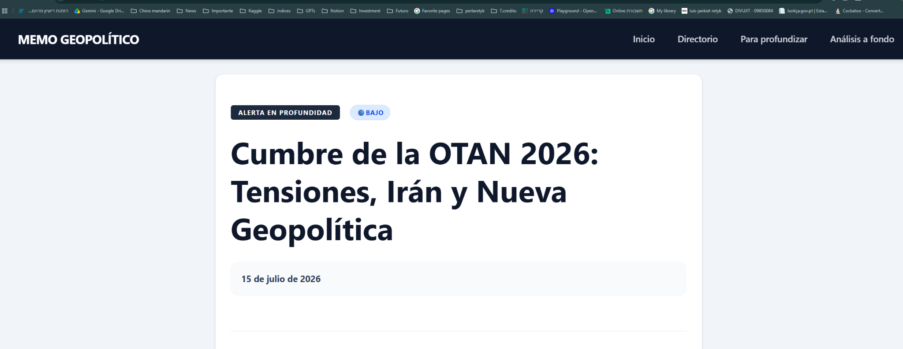

# 09. Estilos y sistema visual

## 9.1 Estrategias coexistentes

El proyecto tiene dos sistemas visuales:

1. **Sitio editorial:** utilidades Tailwind en componentes y páginas.
2. **Directorio:** CSS propio con variables, clases BEM-like y tema oscuro.

Esta separación ayuda a encapsular el dashboard, pero produce duplicación de tokens, tipografías, radios, sombras y colores.

## 9.2 Tailwind actual

- Integración mediante `@tailwindcss/vite` en `astro.config.mjs`.
- `global.css` usa `@import 'tailwindcss'`.
- Plugin Typography se carga con `@plugin`.
- Severidades se declaran en `@theme`.
- `tailwind.config.mjs` repite severidades y plugin.

El build funciona, pero se debe elegir una sola fuente de configuración y documentarla.

## 9.3 Tokens de severidad

| Nivel | Token | Color |
|---|---|---|
| Critical | `critical` | `#EF4444` |
| High | `high` | `#F97316` |
| Medium | `medium` | `#F59E0B` |
| Low | `low` | `#3B82F6` |

Los mismos colores están hardcodeados nuevamente en `MapaGlobal.astro` y el template de profundidad. La duplicación puede generar divergencia.

## 9.4 Tipografía

- Layout carga Playfair Display.
- Portada aplica Playfair a todos los headings mediante estilo global dentro de `index.astro`.
- Páginas de ensayo usan explícitamente `font-serif`.
- Header usa `font-sans`, pero su `<h1>` recibe Playfair en portada por la regla global de la página.
- Directorio declara Inter, pero Layout no lo carga.

Resultado visible: la marca del Header cambia entre portada y artículos. En las capturas, la portada muestra logo serif con icono; los artículos muestran marca sans sin icono.



## 9.5 Sistema del directorio

`dashboard-root` define variables para:

- superficies y texto;
- línea y sombra;
- color primario y acento;
- estados good/warn/danger;
- radio y foco.

También tiene tema oscuro persistente, breakpoints en 1180 y 760 px y estilos de impresión.

Fortalezas:

- encapsulación por selector raíz;
- foco visible;
- colores semánticos;
- layout adaptable;
- impresión considerada.

Deuda:

- CSS de gran tamaño embebido en una página;
- no reutiliza tokens globales;
- clases no tipadas ni documentadas;
- Inter no cargada;
- algunas medidas y colores están hardcodeados en JavaScript.

## 9.6 Responsive

### Portada

El grid cambia de 12 columnas a una columna por debajo de `lg`. El orden será:

1. alertas;
2. mapa y ensayos;
3. panel derecho.

No existe ajuste específico del header ni de su navegación. El mapa mantiene `aspect-ratio: 2/1`, que puede resultar demasiado bajo en pantallas estrechas.

### Directorio

- filtros: 6 columnas → 3 → 1;
- KPIs: 5 → 3 → 2;
- charts: 4 → 2 → 1;
- tabla: conserva mínimo de 1260 px y usa scroll horizontal;
- modal: detalle pasa a una columna.

## 9.7 Recomendación de design system

Crear una capa de tokens globales:

```css
@theme {
  --font-ui: 'Inter', system-ui, sans-serif;
  --font-editorial: 'Playfair Display', Georgia, serif;
  --color-surface: ...;
  --color-text: ...;
  --color-border: ...;
  --color-severity-critical: ...;
  --radius-card: ...;
  --shadow-card: ...;
}
```

Y componentes básicos:

- `SiteHeader` y `MobileNav`;
- `SectionHeading`;
- `Card`;
- `Badge`;
- `SeverityBadge`;
- `Button`;
- `ArticleHeader`;
- `EmptyState`;
- `Dialog`.

## 9.8 Baseline visual

Las capturas incluidas en `docs/assets` constituyen referencia del estado previo a la modularización. Cualquier refactor debe comparar:

- jerarquía y anchura de columnas;
- espaciado y tipografía;
- colores de severidad;
- altura y posición del mapa;
- ancho de lectura de artículos;
- estado sticky del header.
