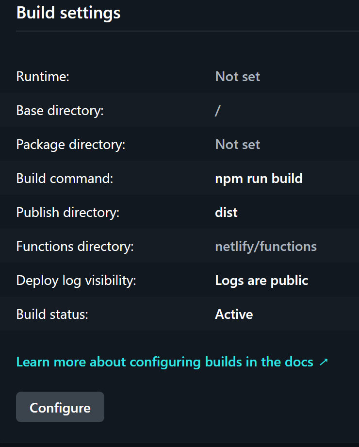
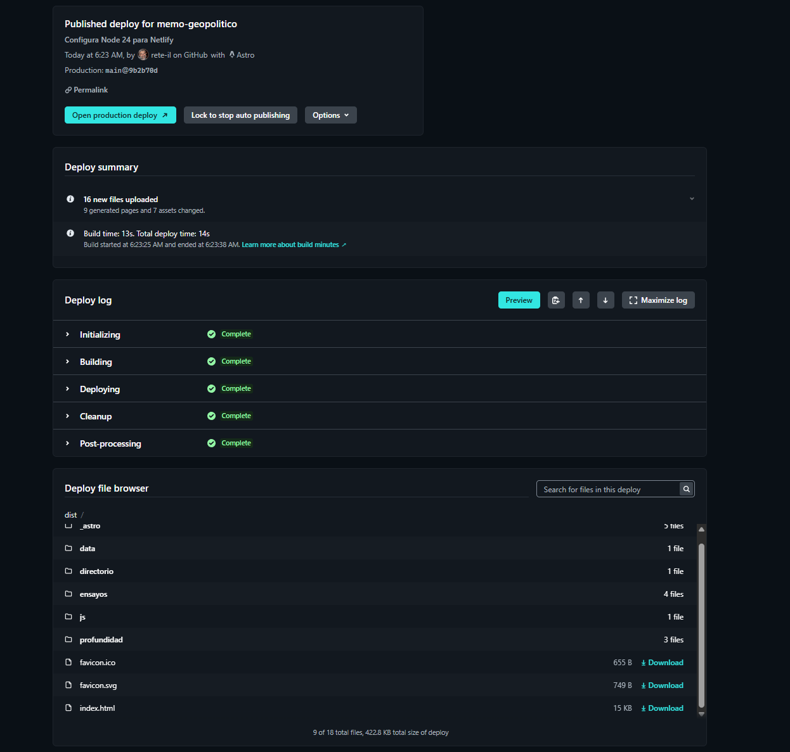

# 12. Build, preview y Netlify

## 12.1 Configuración actual de Astro

```js
export default defineConfig({
  site: 'https://memogeopolitico.com',
  vite: { plugins: [tailwindcss()] },
});
```

No se configura adapter; la salida observada es estática.

## 12.2 Scripts disponibles

```json
{
  "dev": "astro dev",
  "build": "astro build",
  "preview": "astro preview",
  "astro": "astro"
}
```

No existe todavía `check`, `test`, `lint` ni un script de validación de enlaces.

## 12.3 Artefacto de producción

`npm run build` crea `dist/`. Netlify publica solamente esa carpeta. En la configuración de producción se verificaron estos valores:

| Campo                 | Valor observado     | Evaluación                                                                |
| --------------------- | ------------------- | ------------------------------------------------------------------------- |
| Runtime               | `Not set`           | No se usa un runtime de Functions; la versión de Node se gestiona aparte. |
| Base directory        | `/`                 | Correcto: el proyecto vive en la raíz del repositorio.                    |
| Package directory     | `Not set`           | Correcto: no es monorepo.                                                 |
| Build command         | `npm run build`     | Correcto.                                                                 |
| Publish directory     | `dist`              | Correcto.                                                                 |
| Functions directory   | `netlify/functions` | Valor por defecto; no existen funciones en la instantánea.                |
| Deploy log visibility | Logs públicos       | Revisar si el repositorio o futuros secretos requieren restringirlos.     |
| Build status          | Active              | Correcto para despliegue continuo.                                        |



Netlify documenta que solo el contenido de la carpeta de publicación llega al deploy. Esto explica por qué archivos ubicados en la raíz, pero no copiados a `dist`, no quedan disponibles públicamente.

## 12.4 Published deploy verificado

| Dato               | Valor observado                                                          |
| ------------------ | ------------------------------------------------------------------------ |
| Proyecto           | `memo-geopolitico`                                                       |
| Tipo               | Published deploy / Production                                            |
| Rama               | `main`                                                                   |
| Commit             | `9b2b70d`                                                                |
| Mensaje            | `Configura Node 24 para Netlify`                                         |
| Build              | 13 s                                                                     |
| Deploy total       | 14 s                                                                     |
| Archivos nuevos    | 16                                                                       |
| Páginas generadas  | 9                                                                        |
| Assets modificados | 7                                                                        |
| Fases              | Initializing, Building, Deploying, Cleanup y Post-processing: `Complete` |



Un **published deploy** es la versión que Netlify sirve en el dominio principal. Los deploys son atómicos: la nueva versión reemplaza a la anterior solo cuando todos los archivos están listos.

## 12.5 Dominio y HTTPS

- Dominio principal: `memogeopolitico.com`.
- `www.memogeopolitico.com`: redirección automática al dominio principal.
- Subdominio técnico: `memo-geopolitico.netlify.app`.
- HTTPS: habilitado.
- Certificado: Let’s Encrypt administrado por Netlify.
- Renovación: automática, según la interfaz.
- Alias `beta`: inactivo por decisión operativa y con verificación DNS pendiente.

El detalle completo está en [19-entorno-produccion-netlify.md](./19-entorno-produccion-netlify.md).

## 12.6 Configuración recomendada en archivo

La configuración efectiva reside hoy principalmente en la UI. Conviene versionar los parámetros estables en `netlify.toml` para que otro desarrollador pueda reproducirlos:

```toml
[build]
  command = "npm run build"
  publish = "dist"

[build.environment]
  NODE_VERSION = "24"

[[headers]]
  for = "/*"
  [headers.values]
    X-Content-Type-Options = "nosniff"
    Referrer-Policy = "strict-origin-when-cross-origin"
    X-Frame-Options = "SAMEORIGIN"

[[headers]]
  for = "/_astro/*"
  [headers.values]
    Cache-Control = "public, max-age=31536000, immutable"
```

Antes de agregar una Content Security Policy hay que inventariar Google Fonts, unpkg, CARTO, OpenStreetMap y los scripts de iconos. Una CSP demasiado estricta puede romper el mapa o las fuentes.

## 12.7 Riesgos vigentes después de publicar

- dos enlaces del Header apuntan a rutas no generadas;
- `/ensayos/` se genera sin UI;
- Ko-fi usa `tu_usuario`;
- `/default-og.png` está referenciado pero no existe en la instantánea;
- no existe 404 personalizada;
- `robots.txt` está en la raíz del repositorio, no en `public/`; por tanto, no debe asumirse que llega a `dist`;
- sitemap y RSS no están configurados;
- los logs de deploy figuran como públicos;
- no hay cabeceras de seguridad versionadas;
- no se ha documentado una prueba automática posterior al deploy.

## 12.8 Deploy Previews

Para futuros cambios, trabajar con rama y pull request:

1. crear rama corta, por ejemplo `fix/header-routes`;
2. abrir pull request hacia `main`;
3. revisar el Deploy Preview;
4. ejecutar smoke test desktop y móvil;
5. aprobar y fusionar;
6. verificar el published deploy.

El control mínimo debe abrir:

- `/`;
- `/directorio/`;
- `/ensayos/`;
- un ensayo;
- una profundidad;
- una URL inexistente;
- descarga Excel;
- viewport de escritorio y móvil.

## 12.9 Contenido temporal y frecuencia de build

Como “Hoy/Ayer” y el TTL del mapa se calculan en build, la frecuencia de despliegue afecta la exactitud de la portada. Opciones:

- reconstruir cada vez que se publica o cambia una alerta;
- ejecutar un build programado diario;
- mover el cálculo de tiempo al cliente;
- introducir una fuente dinámica/API en una fase posterior.

## 12.10 Versionado de Node

El deploy muestra un commit destinado a configurar Node 24. La instantánea entregada solo contiene:

```json
"engines": {
  "node": ">=22.12.0"
}
```

Para reproducibilidad, mantener uno de estos mecanismos en el repositorio:

- `.nvmrc`;
- `.node-version`;
- versión exacta o mayor controlada mediante `NODE_VERSION`.

Cuando se reciba una nueva instantánea del repositorio, confirmar qué mecanismo quedó efectivamente incorporado.

## 12.11 Rollback

Ante un error grave:

1. abrir `Deploys` en Netlify;
2. seleccionar el último deploy exitoso anterior;
3. revisar su permalink;
4. usar `Publish deploy` para restaurarlo;
5. bloquear temporalmente auto-publishing si hay pushes que volverían a sobrescribirlo;
6. corregir en una rama y volver a desplegar.

El rollback de Netlify publica un deploy atómico anterior; no reejecuta el build.

## 12.12 Referencias oficiales

- [Build configuration overview](https://docs.netlify.com/build/configure-builds/overview/)
- [Deploy overview](https://docs.netlify.com/deploy/deploy-overview/)
- [Manage deploys and rollbacks](https://docs.netlify.com/deploy/manage-deploys/manage-deploys-overview/)
- [HTTPS and certificates](https://docs.netlify.com/manage/domains/secure-domains-with-https/https-ssl/)
