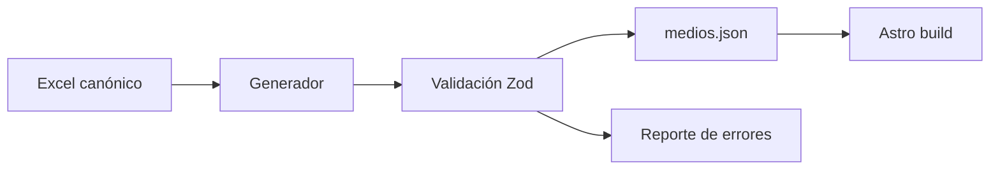

# 16. Plan de modularización

## 16.1 Principio

La refactorización debe preservar comportamiento verificable y separar primero contratos, luego presentación y finalmente interacción. No conviene reescribir todo simultáneamente.

## 16.2 Fase 0 — Congelar baseline

- incorporar esta documentación al repositorio;
- guardar capturas desktop y móvil;
- registrar rutas generadas;
- crear rama de refactor;
- añadir formato automático sin cambiar lógica;
- ejecutar build antes y después de cada lote.

## 16.3 Fase 1 — Correcciones previas a publicación

- decidir rutas reales del Header;
- completar archivo de ensayos;
- mover/eliminar placeholder Indo-Pacífico;
- corregir Ko-fi o retirar CTA;
- crear imagen OG;
- cargar iconos y fuentes globalmente;
- crear 404;
- preparar robots para entorno de producción.

## 16.4 Fase 2 — Contratos y tipos

Crear:

```text
src/types/
├── content.ts
├── media-directory.ts
├── monitor.ts
└── map.ts
```

- tipar props Astro;
- tipar payload de mapa;
- tipar directorio;
- validar JSON con Zod;
- validar que `vinculo` resuelva una página;
- validar coordenadas y puntuaciones.

## 16.5 Fase 3 — Shell y design system

```text
src/components/ui/
├── Badge.astro
├── Button.astro
├── Card.astro
├── Dialog.astro
├── EmptyState.astro
├── SectionHeading.astro
└── SeverityBadge.astro

src/components/site/
├── SiteHeader.astro
├── MobileNav.astro
├── SiteFooter.astro
└── Seo.astro
```

- normalizar tipografías;
- centralizar tokens;
- resolver jerarquía de headings;
- unificar metadata y assets.

## 16.6 Fase 4 — Portada

```text
src/components/home/
├── AlertsPanel.astro
├── AlertCard.astro
├── GlobalMap.astro
├── RecentEssays.astro
└── NarrativeFrictionPanel.astro

src/lib/home/
├── alerts.ts
├── map-data.ts
└── time.ts
```

- mover sort y TTL a funciones probables;
- incorporar foco de teclado;
- establecer fallback del mapa;
- decidir si el monitor sigue como prototipo o se retira de producción.

## 16.7 Fase 5 — Directorio

### Presentación

```text
src/components/directory/
├── DirectoryHero.astro
├── DirectoryFilters.astro
├── DirectoryKpis.astro
├── DirectoryCharts.astro
├── DirectoryTable.astro
├── DirectoryPagination.astro
├── SourceDialog.astro
└── DirectoryFooter.astro
```

### Lógica

```text
src/lib/directory/
├── schema.ts
├── normalize.ts
├── filters.ts
├── sorting.ts
├── aggregations.ts
├── query-state.ts
├── csv.ts
└── theme.ts
```

### Estilos

- migrar variables a tokens compartidos;
- extraer CSS de la página;
- mantener encapsulación durante transición;
- no convertir la tabla a componentes de framework sin necesidad.

### Pruebas prioritarias

- búsqueda con y sin tildes;
- combinación de filtros;
- puntuación mínima;
- orden numérico/textual;
- paginación;
- URL state;
- CSV;
- modal y foco.

## 16.8 Fase 6 — Pipeline de datos

```text
scripts/
├── generate-medios.ts
├── validate-content-links.ts
└── validate-public-assets.ts
```

Proceso recomendado:



## 16.9 Fase 7 — Contenido y rutas

- índice `/profundidad/`;
- archivo `/ensayos/`;
- unificar slugs;
- añadir `draft`, `updatedAt`, `description`, `authors`, `sources`;
- navegación relacionada;
- feeds y sitemap.

## 16.10 Fase 8 — QA y entrega continua

- `astro check`;
- Prettier y ESLint;
- Vitest para funciones puras;
- Playwright para rutas y flujos;
- CI en pull requests;
- Deploy Preview de Netlify;
- Lighthouse budget.

## 16.11 Orden recomendado de ejecución

1. P0 de publicación.
2. Tipos y validaciones sin cambio visual.
3. Header/Layout/SEO.
4. Archivo de ensayos y profundidad.
5. Descomposición del directorio.
6. Pipeline Excel–JSON.
7. Accesibilidad y pruebas.
8. Optimización de rendimiento.

## 16.12 Estrategia de commits

Cada commit debe ser pequeño y verificable. Ejemplos:

```text
docs: add current architecture baseline
fix: point header links to existing routes
refactor: extract directory filter functions
feat: generate media JSON from canonical workbook
test: cover directory URL-state parsing
```
