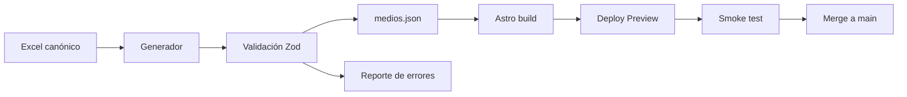

# 16. Plan de modularización

## 16.1 Principio

La refactorización debe preservar comportamiento verificable y separar primero contratos, luego presentación y finalmente interacción. El sitio ya está publicado: cada fase debe usar ramas, Deploy Previews y posibilidad de rollback.

## 16.2 Fase 0 — Congelar baseline de producción

- incorporar esta documentación al repositorio;
- descargar y guardar el deploy actualmente publicado;
- registrar commit `9b2b70d` como baseline de infraestructura;
- capturar desktop y móvil de rutas principales;
- registrar rutas generadas;
- crear rama de refactor;
- ejecutar build antes y después de cada lote;
- no trabajar directamente sobre `main`.

## 16.3 Fase 1 — Correcciones urgentes de producción

Orden recomendado:

1. corregir `/profundizar` y `/analisis` o retirar esos enlaces;
2. completar o desindexar temporalmente `/ensayos/`;
3. retirar/mover el placeholder Indo-Pacífico;
4. corregir Ko-fi o retirar CTA;
5. crear `public/default-og.png`;
6. crear `public/robots.txt` correcto y sitemap;
7. crear 404;
8. cargar iconos globalmente;
9. verificar móvil.

Cada corrección debe pasar por Deploy Preview y smoke test.

## 16.4 Fase 2 — Reproducibilidad de infraestructura

Crear o confirmar:

```text
.nvmrc
netlify.toml
public/robots.txt
public/_headers             # alternativa a netlify.toml
```

- fijar Node 24 de forma versionada;
- versionar build command y publish directory;
- cambiar logs a privados si corresponde;
- añadir cabeceras básicas;
- documentar DNS y aliases;
- decidir si se elimina `beta.memogeopolitico.com` hasta su uso;
- documentar rollback.

## 16.5 Fase 3 — Contratos y tipos

Crear:

```text
src/types/
├── content.ts
├── media-directory.ts
├── monitor.ts
└── map.ts
```

- tipar props Astro;
- tipar payload de mapa;
- tipar directorio;
- validar JSON con Zod;
- validar que `vinculo` resuelva una página;
- validar coordenadas y puntuaciones;
- añadir script que compruebe assets y rutas antes del build.

## 16.6 Fase 4 — Shell y design system

```text
src/components/ui/
├── Badge.astro
├── Button.astro
├── Card.astro
├── Dialog.astro
├── EmptyState.astro
├── SectionHeading.astro
└── SeverityBadge.astro

src/components/site/
├── SiteHeader.astro
├── MobileNav.astro
├── SiteFooter.astro
└── Seo.astro
```

- normalizar tipografías;
- centralizar tokens;
- resolver jerarquía de headings;
- unificar metadata y assets;
- agregar navegación responsive.

## 16.7 Fase 5 — Portada

```text
src/components/home/
├── AlertsPanel.astro
├── AlertCard.astro
├── GlobalMap.astro
├── RecentEssays.astro
└── NarrativeFrictionPanel.astro

src/lib/home/
├── alerts.ts
├── map-data.ts
└── time.ts
```

- mover orden y TTL a funciones probables;
- incorporar foco de teclado;
- establecer fallback del mapa;
- decidir si el monitor sigue como prototipo o se etiqueta claramente;
- diferir el mapa si Lighthouse lo justifica.

## 16.8 Fase 6 — Directorio

### Presentación

```text
src/components/directory/
├── DirectoryHero.astro
├── DirectoryFilters.astro
├── DirectoryKpis.astro
├── DirectoryCharts.astro
├── DirectoryTable.astro
├── DirectoryPagination.astro
├── SourceDialog.astro
└── DirectoryFooter.astro
```

### Lógica

```text
src/lib/directory/
├── schema.ts
├── normalize.ts
├── filters.ts
├── sorting.ts
├── aggregations.ts
├── query-state.ts
├── csv.ts
└── theme.ts
```

### Estilos

- migrar variables a tokens compartidos;
- extraer CSS de la página;
- mantener encapsulación durante transición;
- no incorporar un framework cliente sin necesidad medida.

### Pruebas prioritarias

- búsqueda con y sin tildes;
- combinación de filtros;
- puntuación mínima;
- orden numérico/textual;
- paginación;
- URL state;
- CSV;
- modal y foco;
- descarga Excel.

## 16.9 Fase 7 — Pipeline de datos

```text
scripts/
├── generate-medios.ts
├── validate-content-links.ts
├── validate-public-assets.ts
└── smoke-production.ts
```

Proceso recomendado:



## 16.10 Fase 8 — Contenido y rutas

- índice `/profundidad/`;
- archivo `/ensayos/`;
- unificar slugs mediante redirects;
- añadir `draft`, `updatedAt`, `description`, `authors`, `sources`;
- navegación relacionada;
- feeds, sitemap y JSON-LD;
- metodología y acerca de.

## 16.11 Fase 9 — QA y entrega continua

- `astro check`;
- Prettier y ESLint;
- Vitest para funciones puras;
- Playwright para rutas y flujos;
- CI en pull requests;
- Deploy Preview de Netlify;
- crawler de enlaces;
- Lighthouse budget;
- smoke test automático contra el published deploy.

## 16.12 Orden de ejecución

1. incidencias P0 de producción;
2. reproducibilidad de Netlify y SEO básico;
3. tipos y validaciones sin cambio visual;
4. Header, Layout y SEO;
5. índices de ensayos y profundidad;
6. descomposición del directorio;
7. pipeline Excel–JSON;
8. accesibilidad, pruebas y rendimiento.

## 16.13 Estrategia de ramas y commits

Ejemplo:

```text
main
└── fix/header-routes
    ├── docs: record production baseline
    ├── test: add route smoke checks
    └── fix: point header links to existing indexes
```

Commits pequeños y verificables:

```text
docs: record Netlify production environment
fix: point header links to existing routes
refactor: extract directory filter functions
feat: generate media JSON from canonical workbook
test: cover directory URL-state parsing
```

## 16.14 Puerta de calidad por fase

Una fase no se fusiona hasta que:

- `npm install` o `npm ci` funciona;
- `astro check` funciona cuando sea incorporado;
- build correcto;
- preview local correcto;
- Deploy Preview revisado;
- rutas afectadas probadas;
- móvil revisado si cambia UI;
- documentación actualizada;
- existe plan de rollback.
