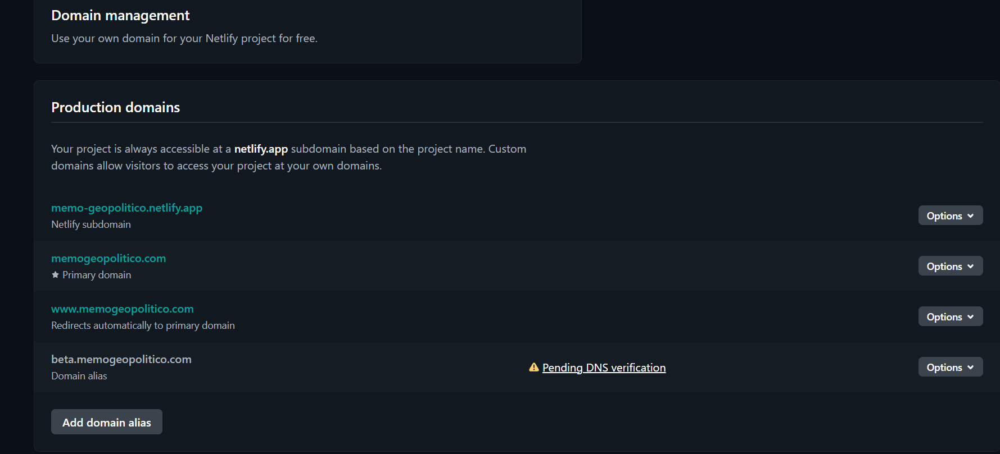
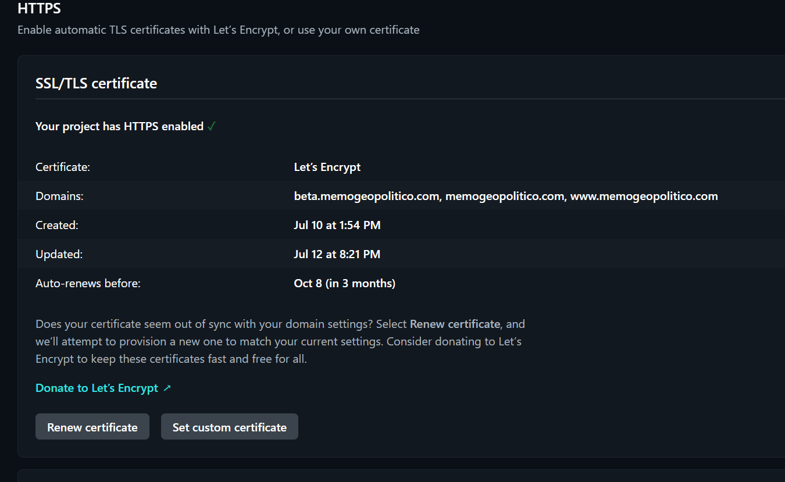
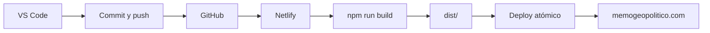

# 19. Entorno de producción y Netlify

## 19.1 Identificación

| Elemento | Valor |
|---|---|
| Plataforma | Netlify |
| Proyecto | `memo-geopolitico` |
| Repositorio | GitHub conectado |
| Rama de producción | `main` |
| Dominio canónico | `https://memogeopolitico.com` |
| Dominio técnico | `https://memo-geopolitico.netlify.app` |
| Tipo de salida | Astro estático |
| Publish directory | `dist` |

## 19.2 Build settings verificados


| Campo | Valor observado |
|---|---|
| Runtime | Not set |
| Base directory | `/` |
| Package directory | Not set |
| Build command | `npm run build` |
| Publish directory | `dist` |
| Functions directory | `netlify/functions` |
| Deploy log visibility | Logs are public |
| Build status | Active |

### Interpretación

- La raíz es correcta porque contiene `package.json`.
- `dist` coincide con la salida de `astro build`.
- No se usan Functions; el directorio configurado no aporta funcionalidad actual.
- Los logs públicos son una decisión revisable, no un error del deploy.
- El runtime de Functions no debe confundirse con la versión de Node del build.

## 19.3 Published deploy


| Elemento | Valor observado |
|---|---|
| Estado | Published deploy |
| Rama/commit | `main@9b2b70d` |
| Mensaje | `Configura Node 24 para Netlify` |
| Build time | 13 s |
| Total deploy time | 14 s |
| Archivos nuevos enviados | 16 |
| Páginas generadas | 9 |
| Assets modificados | 7 |
| Tamaño mostrado | 422,8 KB aproximadamente |
| Fases | todas `Complete` |

### Significado operativo

- El published deploy es la versión servida en el dominio principal.
- El deploy es atómico: no mezcla archivos de la versión anterior y nueva durante la publicación.
- El permalink del deploy debe conservarse en incidentes para reproducir exactamente la versión.

## 19.4 Dominios



| Dominio | Rol | Estado |
|---|---|---|
| `memo-geopolitico.netlify.app` | subdominio Netlify | activo |
| `memogeopolitico.com` | dominio principal | activo |
| `www.memogeopolitico.com` | alias | redirige automáticamente al principal |
| `beta.memogeopolitico.com` | alias reservado | DNS pendiente; inactivo por decisión |

### Política canónica

Todo enlace público, canonical, sitemap y material de comunicación debe usar:

```text
https://memogeopolitico.com
```

No usar el subdominio `.netlify.app` como URL editorial.

## 19.5 HTTPS



La interfaz confirma:

- HTTPS habilitado;
- certificado Let’s Encrypt;
- dominios cubiertos: `beta.memogeopolitico.com`, `memogeopolitico.com` y `www.memogeopolitico.com`;
- certificado creado el 10 de julio y actualizado el 12 de julio;
- autorrenovación prevista antes del 8 de octubre, según la captura.

Netlify gestiona automáticamente la creación y renovación de certificados administrados. La cobertura de `beta` en el certificado no implica que su DNS esté activo.

## 19.6 Decisión sobre beta

Decisión registrada:

> `beta.memogeopolitico.com` no está activo y se mantiene sin DNS verificado para evitar operar un entorno adicional que no se necesita actualmente.

Implicaciones:

- no debe aparecer en documentación pública del producto;
- no debe usarse para pruebas hasta configurar su DNS;
- una advertencia `Pending DNS verification` es esperable;
- no activar HSTS con `includeSubDomains` mientras existan subdominios deliberadamente inactivos;
- puede eliminarse como alias y recrearse después si se desea un panel más limpio.

Para probar cambios sin beta, usar Deploy Previews de Netlify.

## 19.7 Flujo de publicación



### Procedimiento recomendado

1. crear rama;
2. modificar código o contenido;
3. ejecutar `npm run build`;
4. push y pull request;
5. revisar Deploy Preview;
6. fusionar a `main`;
7. abrir el deploy de producción;
8. comprobar que sea `Published`;
9. ejecutar smoke test;
10. registrar el commit en el changelog.

## 19.8 Rollback

Netlify conserva versiones del sitio. Para revertir:

1. `Deploys`;
2. abrir un deploy exitoso anterior;
3. comprobar su contenido mediante permalink;
4. seleccionar `Publish deploy`;
5. bloquear auto-publishing temporalmente si es necesario;
6. corregir en rama y publicar de nuevo.

## 19.9 Seguridad operativa

- Cambiar logs a privados cuando no exista una necesidad explícita de compartirlos.
- No colocar secretos en `netlify.toml` ni en el repositorio.
- Usar variables de entorno de Netlify si aparecen APIs futuras.
- Habilitar 2FA en GitHub y Netlify.
- Revisar permisos de colaboradores.
- Versionar cabeceras y redirects.
- Conservar una copia local del último deploy estable antes de refactors importantes.

## 19.10 Referencias oficiales

- [Deploy overview](https://docs.netlify.com/deploy/deploy-overview/)
- [Build configuration overview](https://docs.netlify.com/build/configure-builds/overview/)
- [Production deploy](https://docs.netlify.com/deploy/deploy-types/production-deploy/)
- [Manage multiple domains](https://docs.netlify.com/manage/domains/manage-domains/manage-multiple-domains/)
- [HTTPS and certificates](https://docs.netlify.com/manage/domains/secure-domains-with-https/https-ssl/)
